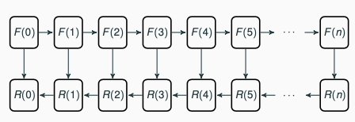

# Summary

PDE Inverse problems are usually solved using gradient-descent methods. This requires the computation of derivatives - which are often computed using the adjoint method. The computation of derivatives introduces a considerable memory footprint for the solver program since the intermediate solution states, which can be discarded when solving the forward problem alone, become critical when solving the adjoint problem. For example, in seismic imaging, it is common to see this peak memory footprint go up to terabytes of RAM. 

A common approach to avoiding this large memory footprint is called checkpointing. In this approach, instead of storing the entire trajectory of intermediate states through the PDE solution, a subset is stored in memory while the others are discarded to save memory. During the adjoint computation, when a state is required that was discarded, the adjoint computation is paused, and the forward computation is restarted from the last available checkpoint to recompute the missing states.

This library provides a simple interface to implement checkpointing in application code with minimal changes. 

# Statement of need
Derivative calculation is an integral part of many types of computational problems like PDE constrained optimisation, inverse problems and training a neural network. The adjoint method (aka backpropagation) is a computationally efficient method of computing derivatives at a cost that is a small constant times the cost of computing the function itself. 

As can be seen in Figure \autoref{fig:dataflow}, this method involves a forward computation that produces data in sequential order. After the end of this forward computation, a reverse computation starts, which uses the data generated by the forward computation in the reverse order. This data being produced by the forward computation is the source of the high memory requirement of adjoint computations or training a neural network. When the memory available is not enough to store all this data, it becomes necessary to discard some of this data. When the reverse computation requires some data that was earlier discarded, this data can be recomputed by rerunning the forward computation from the last available state. There are many sophisticated strategies for this checkpoint-restart approach published in literature - they consider optimality under different assumptions. The implementation of these optimal strategies in application code is often a tedious and error-prone process. It is common to see suboptimal checkpointing strategies implemented in research software due to the complexity. 

This library presents a new approach to implement checkpointing in application code using callbacks. The application provides pointers for the forward and adjoint functions as well as to the data structures. The library then manages checkpoint-restart automatically, on calls to functions called `forward` and `reverse`. The separation of concerns introduced by this approach allows PyRevolve to implement new strategies as schedulers in a small amount of code - and the application can leverage the strategies using option-switches. This makes it possible to implement and experiment with sophisticated checkpointing strategies with minimal coding effort. PyRevolve currently supports in-memory checkpointing using the Revolve[@revolve] scheduler. We plan to extend this to support other schedulers and multi-level checkpointing to local and network-attached storage. 

PyRevolve also supports the compression of checkpoints. We have already integrated blosc[@blosc] and zfp[@zfp]. Since zfp is a lossy compression algorithm, this extends the previous memory-compute tradeoff into a memory-compute-precision tradeoff. We have used this to enable our research into checkpoint-compression strategies [@kukreja2019combining].

Automatic differentiation libraries like dolfin-adjoint [@mitusch2019dolfin] include an implementation of checkpointing using the Revolve algorithm. However, PyRevolve's primary purpose is to encapsulate and provide a simple interface to advanced checkpointing strategies in application code. PyRevolve is also unique in supporting the (lossy) compression of checkpoints out of the box. 

Other examples of research enabled by PyRevolve include @kukreja2019training, @louboutin2020modeling, @witte2020event, @witte2019compressive, @witte2019large, @louboutin2019devito. 

# Acknowledgements

This project benefited greatly from discussions with Simon W. Funke. It also includes code from the original Revolve library written by Andrea Walther. (For Jan: I'm proposing this as an alternative to including them as authors. I am open to either option. )

# References
